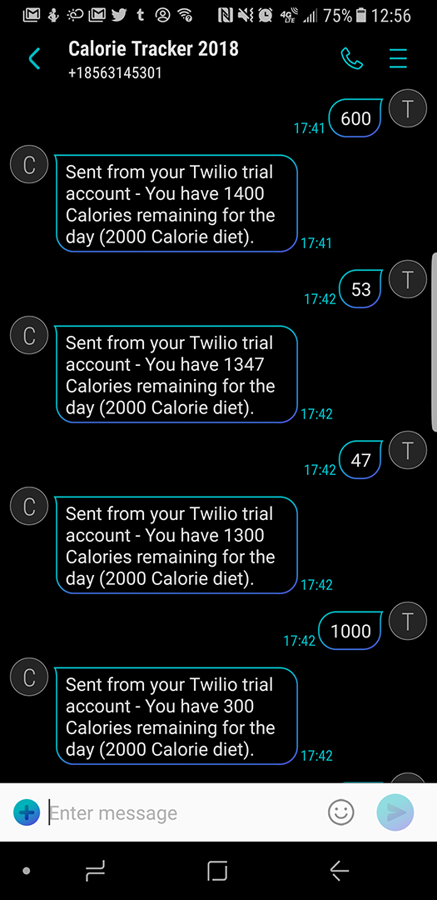
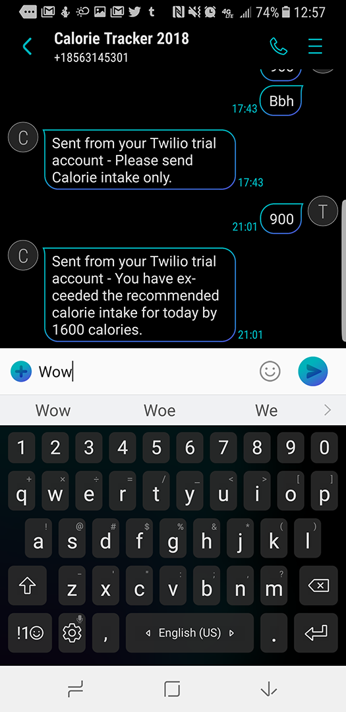

# CalorieTracker
Calorie Tracker is an app that allows you to keep track of how many calories you consume each day. Its convenience is in its ability to do this through SMS (text messages) so that even people with limited access to computers or smartphones are able to use it. Using it is super simple: just text the amount of calories you have eaten so far to the number below and it will respond quickly. **IMPORTANT: This does not work for all phone numbers. We only have a trial account and thus need to authorize each number individually before they can use the service.**

#### Text your calorie intake to (856) 314 5301.

### Screenshots:

### Resources Used:
We followed [this](https://www.twilio.com/docs/quickstart/python/sms) guide to set up this app.
